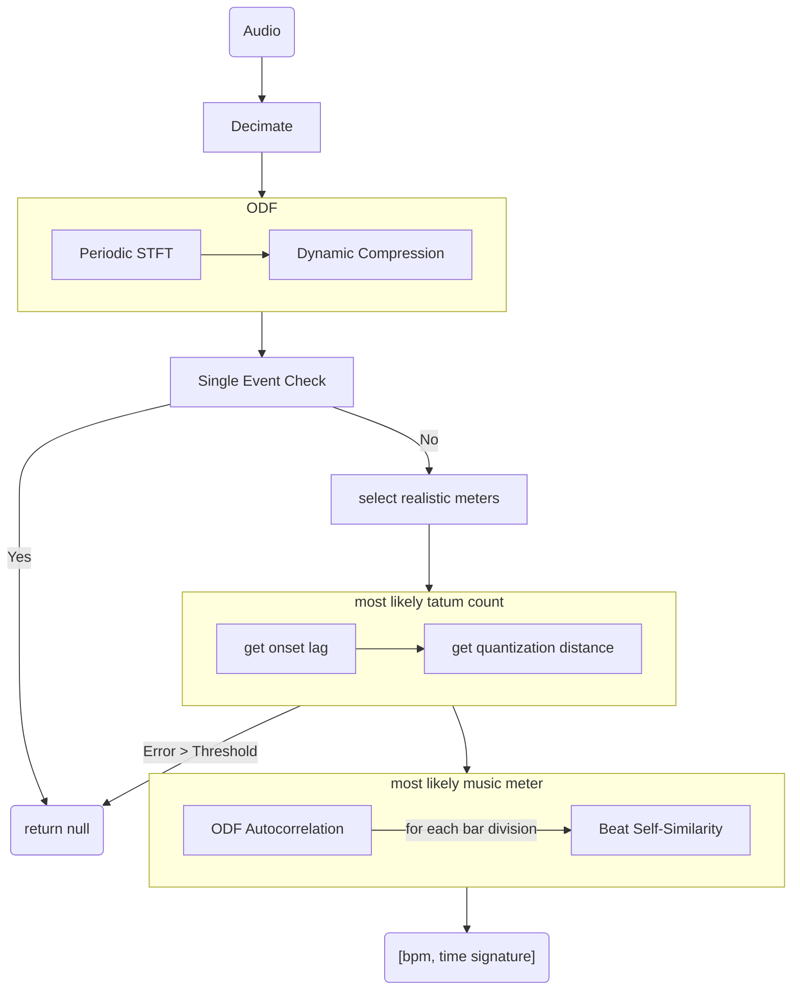

```python

def estimate_tempo(audio_input, threshold):

    audio_duration = get_duration(audio_input)

    # Decimate by 2 until sample rate <= 24kHz
    decimated_audio = decimate(audio_input)

    ODF = compute_onset_detection_function(decimated_audio)

    [peak_indices, peak_values] = find_peaks(ODF)

    if is_single_event(peak_indices, peak_values):
        return null

    division_hierarchy_map = select_realistic_meters(audio_duration)

    tatum_count_candidates = division_hierarchy_map.keys()

    [best_tatum_count, best_tatum_count_error] = select_most_likely_tatum_count(ODF, peak_indices, peak_values, tatum_count_candidates)

    if best_tatum_count_error > threshold:
        return null

    possible_bar_divisions = division_hierarchy_map[best_tatum_count]

    [bpm, time_signature] = get_most_likely_music_meter(ODF, best_tatum_count, possible_bar_divisions, audio_duration)

    return [bpm, time_signature]
```


### Decimation

### Onset Detection Function

```python
def compute_onset_detection_function(audio_input):

    ODF = []
    firstSpec = null
    prevSpec = null
    for frame in get_stft_frames(audio_input):
        newSpec = get_power_spectrum(frame)
        # Make softer elements more prominent
        newSpec = compress_spectrum(newSpec)
        if firstSpec is null:
            firstSpec = newSpec
        else
            ODF.append(get_novelty_measure(prevSpec, newSpec))
        prevSpec = newSpec

    # Since we're testing the hypothesis that it's a loop, in which case the ODF would be a periodic function.
    ODF.append(get_novelty_measure(prevSpec, firstSpec))

    return ODF
```

#### get_stft_frames

Take the power-of-two number of STFT frames that yields the hop size closest to 10ms. (Hop size from last to first frame contains accumulated rounding error.)

### get_novelty_measure

```python
def compress_spectrum(prevSpec, newSpec):
    return sum(abs(max(newSpec - prevSpec, 0)))
```

### Division Hierarchy Map

```python
def select_realistic_meters(audio_duration):

    possible_tatums_per_beat = [(1, 1), (2, 1), (3, 1), (4, 1), (6, 1), (1, 2), (1, 3), (1, 4), (1, 6)]

    division_hierarchy_map = {}
    min_bpm = 50
    max_bpm = 200
    min_tatums_per_minute = 100
    max_tatums_per_minute = 700
    min_bar_duration = 1 # second
    max_bar_duration = 4 # seconds
    min_num_bars = audio_duration / max_bar_duration
    max_num_bars = audio_duration / min_bar_duration
    for num_bars in range(min_num_bars, max_num_bars + 1):
        bar_duration = audio_duration / num_bars
        min_beats_per_bar = min_bpm * bar_duration / 60
        max_beats_per_bar = max_bpm * bar_duration / 60
        for beats_per_bar in range(min_beats_per_bar, max_beats_per_bar + 1):
            for tatums_per_beat in possible_tatums_per_beat:
                tatums_per_bar = beats_per_bar * tatums_per_beat
                if not is_round(tatums_per_bar):
                    continue
                num_tatums = num_bars * tatums_per_bar
                tatums_per_minute = 60 * num_tatums / audio_duration
                if min_tatums_per_minute <= tatums_per_minute <= max_tatums_per_minute:
                    # A possible candidate
                    bar_divisions = division_hierarchy_map[num_tatums]
                    # A same number of tatums can be explained by different bar divisions
                    bar_divisions.append(BarDivision(num_bars, beats_per_bar))
```

### Evaluation of Tatum Count Candidates

```python
def select_most_likely_tatum_count(ODF, peak_indices, peak_values, tatum_count_candidates):

    # Maps tatum count to OnsetQuantization struct, which is {error, lag, num_divisions}
    quantizations = []
    for tatum_count in tatum_count_candidates:
        lag = get_onset_lag(ODF, tatum_count)
        distance = get_quantization_distance(peak_indices, peak_values, len(ODF), tatum_count, lag)
        quantizations[tatum_count] = { distance, lag, tatum_count }

    # best_fit is the quantization which has the lest distance:
    [distance, lag, tatum_count] = min(quantizations, key=lambda x: x['distance'])
    return [distance, lag, tatum_count]
```