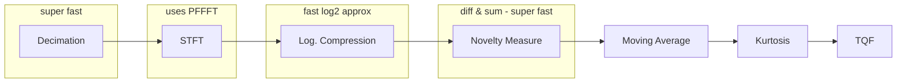

```mermaid
graph LR;
    subgraph V[super fast]
      Decimation
    end
    subgraph F[uses PFFFT]
      STFT
    end
    subgraph C[fast log2 approx]
      Compression[Log. Compression]
    end
    subgraph D[diff & sum - super fast]
      Novelty[Novelty Measure]
    end
    Decimation --> STFT --> Compression --> Novelty --> MA[Moving Average] --> Kurtosis --> TQF
```
