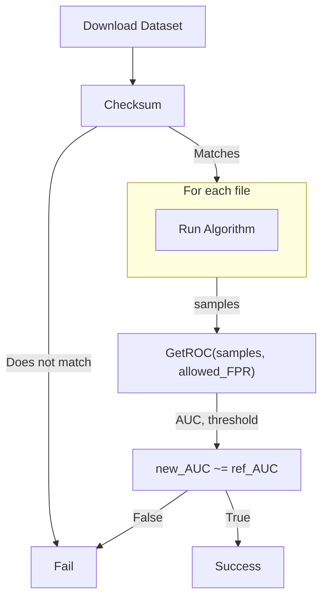

# Product requirements

Audacity 3.4 releases non-destructive time stretching.
Next step : automatically detect tempo.
Looked at existing solutions (Sonic Visualizer) [doc] -> problems
David's "assume-it's-a-loop" advice.

# Genesis

Goal: need to find BPM.
What is the beat? The pulse to which we most comfortable tap.
Not black or white. What matters? Strength, speed, maybe regularity?
Strength, speed, regularity... of what?
Of bursts of energy.

-> Onset Detection Function
Where are the beats? -> false positives and false negatives.
Literature starts from here.
We are lucky: only care for loops
1. round number of measures
2. Assume 4/4? Yes.
3. Finite BPM range
-> Finite number of hypotheses !

Fit number of beats onto ODF. How do we evaluate?
Tried approaches (which ones?)
Weighted distance average.

Tatums also have peaks. So this is only suitable to tatum rate, not beat rate.

### Disambiguation

Tatum rate is not end goal. Assuming 4/4, say our algorithm says 24 tatums is the best match. We still have to decide the number of bars. Is this 2 bars of 12 tatums, i.e., a shuffle rhythm? Or 3 bars of 8?
List of possible tatums per bar:
* 4 (heavy rhythm)
* 8 (very likely)
* 12 (shuffle, "The way you make me feel")
* 16
* 24 (just swing the 16 rhythm)
* 2
* 1

### 2-D sparse grid

Given audio duration, limited BPM range and assuming 4 beats per bar, we can list the possible number of bars. Knowing limited tatums per bar, we come to a 2D grid.

#### Tatum rate is the limit

Is the max measure count combined with max tatums per bar our upper limit? No. Higher BPM tends to mean less tatums per beat. (Find song which ends with accelerando.)

Fastest tatum rate of 12 per second. Grid entries yielding something faster can be ignored.

---

#### Evaluation of entries

How can we compare probabilities ?
* tatums count : use tatum fit
* bar count : use probability of underlying BPM.

## Combined probability: evaluate likelihood of entries

### Tatum count score
Based on fit value

### Time signature likelihood
Bayesian-ish measure $P(\text{time signature} | \text{BPM}) = P(\text{BPM} | \text{time signature}) \cdot P(\text{time signature})$

### Measure count

## Evaluate tatum rate fits

2. Looking at just the tatum rates, evaluate fitting quality and keep the best tatum rate.
3. We still have several meters.

Evaluate possible meters -> yields tatum rates.
Fit tatum rates -> best tatum rate wins.
Re-evaluate meters for this tatum and take the most likely one.

# Overview of algorithm

To make sure we don't miss anything, have a look at the flowchart.

# Tuning and Evaluation framework

While tweaking the algorithm to improve quality or performance, we need an easy way of making sure that we've not changed anything.

## Evaluation metric
Metric to improve quality: AUC
For this we need a representative dataset with ground truths: loop yes or no.

## Dataset
### Source
Audacity is open-source -> must be redistributable -> freesound.org
### Labels
Manually checked.

## Procedure
First, make sure the dataset is still the same -> checksum

Then run algorithm on all samples of the dataset.

